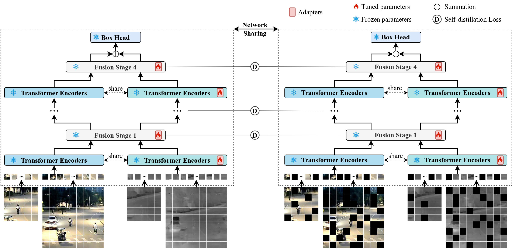

# SDSTrack

This is an official release of the **CVPR 2024** paper: [SDSTrack: Self-Distillation Symmetric Adapter Learning for Multi-Modal Visual Object Tracking](https://arxiv.org/abs/2403.16002).

[Models & Raw Results](https://drive.google.com/drive/folders/1e-xfEaq3HziN3wZ2ebHEJYhJsU7-5jKv?usp=drive_link)(Google Driver)  [Models & Raw Results](https://pan.baidu.com/s/1Q4XbxmuAu7VyhFqNp63IJA?pwd=qolo)(Baidu Driver: qolo)

<p align="center">
  
</p>

## News

**[Mar 26, 2024]**

✅ We release codes, models and raw results.

**[Feb 27, 2024]**

✅ SDSTrack is accepted to CVPR2024.

## Highlights

&#x1F4A1; SDSTrack uses lightweight adapters for parameter-efficient fine-tuning and can be used for various modality combinations.

&#x1F4A1; We employ a symmetric design, treating all modalities equally, thereby reducing modality dependencies.

&#x1F4A1; We significantly improve the robustness of trackers through complementary masked patch distillation.

&#x1F4A1; SDSTrack performs excellently even in extreme scenarios, such as modality absence and severe occlusion.

## Usage

### Install the environment

Create and activate a conda environment:

```
conda create -n sdstrack python=3.8
conda activate sdstrack
```

Install the required packages:

```
bash install_sdstrack.sh
```

### Data Preparation

Put the training datasets in `./data/`. It should look like:

```
$<PROJECT_ROOT>
-- data
    -- depthtrack/train
        |-- adapter02_indoor
        |-- bag03_indoor
        ...
    -- lasher/trainingset
        |-- 1boygo
        |-- 1handsth
        ...
    -- visevent/train
        |-- 00142_tank_outdoor2
        |-- 00143_tank_outdoor2
        ...
        |-- trainlist.txt
```

### Set project paths

Run the following command to set paths:

```
cd <PROJECT_ROOT>
python tracking/create_default_local_file.py --workspace_dir . --data_dir ./data --save_dir ./output
```

You can also modify paths with these two files if needed:

```
lib/train/admin/local.py      # paths for training
lib/test/evaluation/local.py  # paths for testing
```

### Training

Download the pretrained [foundation model](https://drive.google.com/drive/folders/1ttafo0O5S9DXK2PX0YqPvPrQ-HWJjhSy?usp=sharing) (OSTrack) and put it under `$PROJECT_ROOT$/pretrained`. To train RGB-Depth tracking, you can run:

```
bash train_sdstrack_rgbd.sh
```

You can also train various modality combinations by ```bash train_sdstrack_rgbe.sh``` and ```bash train_sdstrack_rgbt.sh```.

### Evaluation

- **RGB-Depth benchmarks**

  Two benchmarks (DepthTrack testing set and VOT22_RGBD) are evaluated using [VOT-toolkit](https://github.com/votchallenge/toolkit).

  - Put the DepthTrack testing set to `./Depthtrack_workspace/` and rename it `sequences`.
  - Download the VOT22_RGBD testing set, put it to```./VOT22RGBD_workspace/``` and also rename it `sequences`.

  ```
  bash eval_rgbd.sh
  ```

* **RGB-Thermal benchmarks**

  Two benchmarks (LasHeR testing set and RGBT234) are evaluated.

  ```
  bash eval_rgbt.sh
  ```

  We refer you to [LasHeR Toolkit](https://github.com/BUGPLEASEOUT/LasHeR) for LasHeR evaluation and [MPR_MSR_Evaluation](https://sites.google.com/view/ahutracking001/) for RGBT234 evaluation.

* **RGB-Event benchmarks**

  One benchmark (VisEvent) is evaluated. Please modify the <DATASET_PATH> and <SAVE_PATH> in`./RGBE_workspace/test_rgbe_mgpus.py`, then run:

  ```
  bash eval_rgbe.sh
  ```

## Acknowledgments

* Thanks for the [OSTrack](https://github.com/botaoye/OSTrack) and [PyTracking](https://github.com/visionml/pytracking) library, which help us to quickly implement our ideas.
* We Thank for the [ViPT](https://github.com/jiawen-zhu/ViPT), which is an excellent and inspiring work.

## Citation
If our work is useful for your research, please consider citing:
  ```
  @InProceedings{Hou_2024_CVPR,
    author    = {Hou, Xiaojun and Xing, Jiazheng and Qian, Yijie and Guo, Yaowei and Xin, Shuo and Chen, Junhao and Tang, Kai and Wang, Mengmeng and Jiang, Zhengkai and Liu, Liang and Liu, Yong},
    title     = {SDSTrack: Self-Distillation Symmetric Adapter Learning for Multi-Modal Visual Object Tracking},
    booktitle = {Proceedings of the IEEE/CVF Conference on Computer Vision and Pattern Recognition (CVPR)},
    month     = {June},
    year      = {2024},
    pages     = {26551-26561}
}
  ```
